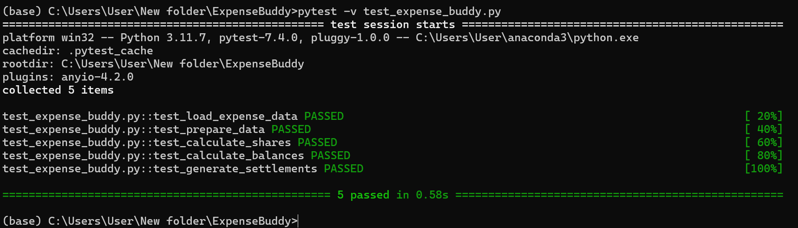

# Expense Buddy

## Author

Shuya Lin (6068251)

## Brief Description

Expense Buddy is a tool designed to simplify the process of sharing and settling expenses among roommates. It takes a CSV file as input, containing details about shared expenses such as the amount, payer, and participants. Expense Buddy calculates how much each roommate owes to or is owed by others, ensuring a fair and accurate split of expenses. This tool helps roommates keep track of shared costs and manage reimbursements efficiently. The output is a detailed summary of individual balances, making it easy for everyone to see who owes what and to settle payments accordingly.

## Algorithm and Libraries

- **Algorithm**: The core algorithm involves parsing and aggregating the expense data to identify total payments made and amounts owed by each participant. It calculates the fair share of each expense for all involved roommates, then determines the net balance by comparing individual contributions and liabilities. Based on these calculations, it provides a breakdown of amounts owed between roommates.

- **Libraries**: 
  - **Pandas**: For reading, organizing, and analyzing the CSV data.
  - **NumPy**: For numerical computations, such as calculating totals and balancing payments.

## Data Needed

Expense Buddy requires a CSV file containing the following data:

- **Date**: Date the expense was incurred.
- **Amount**: Total amount spent (e.g., `100.00`).
- **Payer**: Name of the roommate who paid for the expense (e.g., `Alice`).
- **Participants**: Comma-separated names of roommates who shared the expense (e.g., `Alice,Bob,Charlie`).

Each row in the CSV file represents a single expense and should include all columns mentioned above.

## Expected Outcome

Expense Buddy provides a detailed breakdown of shared expenses, including:

- **Individual Balances**: The amount each roommate owes or is owed.
- **Settlement Instructions**: Recommendations on how roommates can settle their balances with one another.
- **Expense Summary**: A detailed view of each person’s contributions and share of the expenses.

The program’s output will help roommates easily understand and settle debts, making shared expense management clear and fair.

## How to Run

To run the project, you need to have Python installed. Then you can run the following command:

```bash
python expense_buddy.py <path_to_csv_file>
```
## Testing
To verify that all functions work as expected, you can run the tests provided in `test_expense_buddy.py`. Use the following command to run the tests:

```bash
pytest -v test_expense_buddy.py
```

Below is a screenshot of the test results, showing that all tests have passed successfully:




